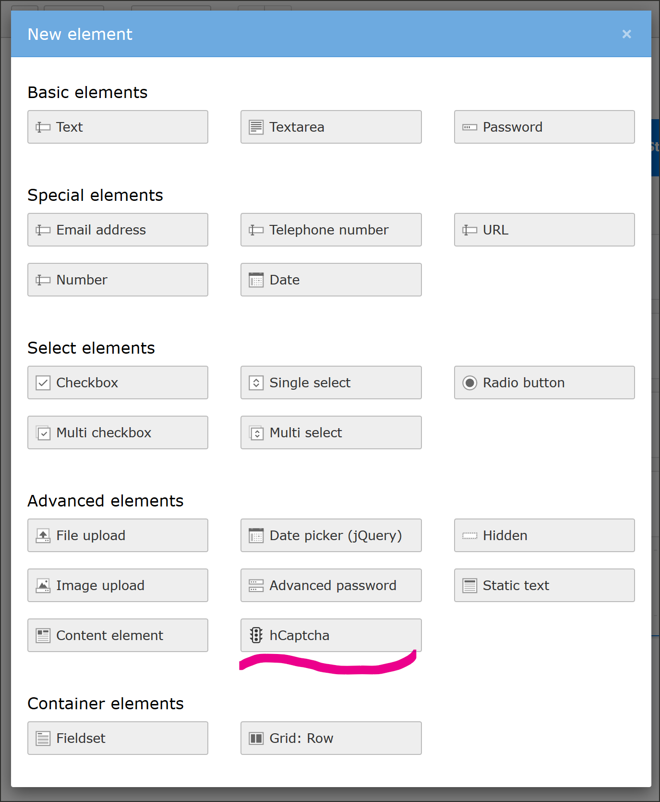
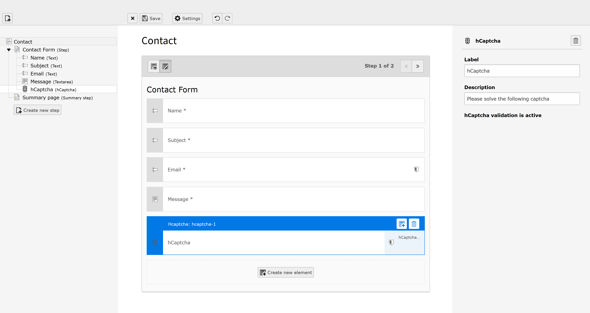

.. include:: ../Includes.txt

.. _for-editors:

===========
For Editors
===========

The `hCaptcha` extension adds a new element to the form editor.

To add a captcha to a form:

- open the form editor
- click "new element"
- choose `hCaptcha` from the wizard
- position the element where you want it to appear
- add a (optional) description
- click :guilabel:`Save`

