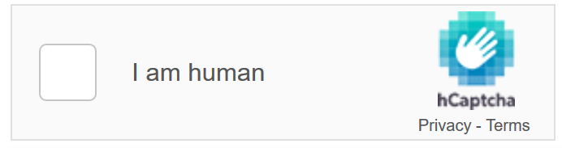

.. include:: Includes.txt

.. _start:

=============================================================
hCaptcha - privacy friendly, GDPR-compliant captcha for TYPO3
=============================================================

:Version:
   |release|

:Language:
   en

:Authors:
   Waldhacker | Ralf Zimmermann | Susanne Moog |

:Website:
   https://waldhacker.dev

:License:
   This extension documentation is published under the
   `CC BY-NC-SA 4.0 <https://creativecommons.org/licenses/by-nc-sa/4.0/>`__ (Creative Commons)
   license

   hCaptcha - the privacy friendly Google reCaptcha alternative

.. toctree::
   :maxdepth: 3

   Introduction/Index
   Installation/Index
   Configuration/Index
   Editor/Index
   Changelog
   Sitemap

**Community Documentation**

This documentation is community documentation for the TYPO3 extension {extension.name}

It is maintained as part of this third party extension.

If you find an error or something is missing, please:
`Report a Problem <https://github.com/waldhacker/ext-hcaptcha/issues>`__
