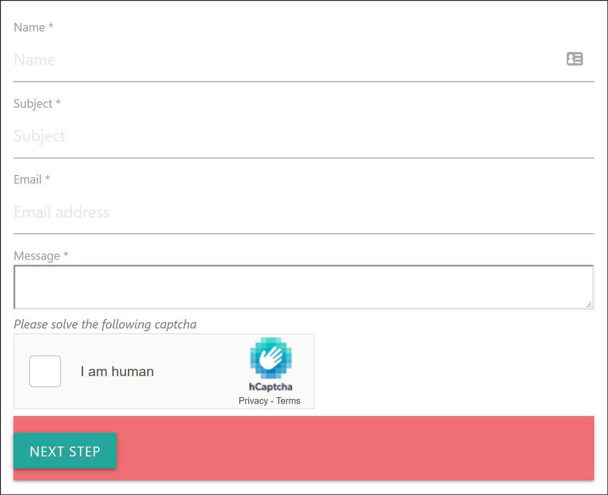

.. include:: ../Includes.txt

.. _introduction:

============
Introduction
============

The `hCaptcha` extension adds a captcha to TYPO3 system extension `form` to stop spam/bots reliably.
`hCaptcha` is a free-to-use service for sites of any size - you can even earn a bit of money with
it. Find more information on their website: https://www.hcaptcha.com/.

It has a similar feature set to Google's reCaptcha, with a significant focus on privacy and GDPR-compliance.

   Contact Form with hCaptcha protection.

The extension adds an advanced element `Captcha` to the TYPO3 form extension, which allows flexible usage
of the captcha on a per-form basis.
